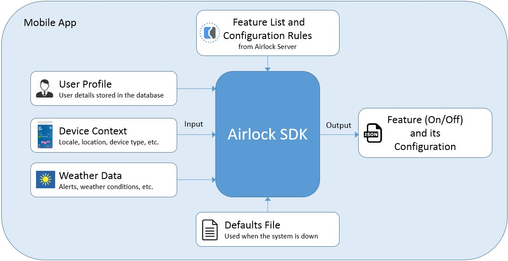
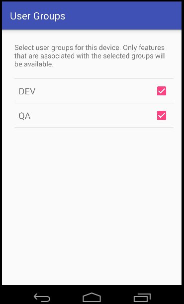

# Airlock SDK for Android
The Airlock SDK determines which features are enabled for a particular application based on  
the user profile and device context (locale, location, device type, etc.).
## Stable Version
5.4.2
## System Requirements
* Android SDK version 16 or later

## Configuring your application to use the Airlock SDK
Do the following steps to integrate the Airlock SDK with your Android project:

1. Open the `build.gradle` file of your project and add the following line to the `dependencies` code section:							
	
	`implementation "com.weather.android:airlock-sdk-android:<version>"`

	Here is a sample code snippet of `build.gradle` file:
	````
	apply plugin: 'com.android.application'

	repositories {
            ....
            mavenCentral()
            ....
    }
	android {
	   
	    defaultConfig {
	    .....
	    }
	}
	
	dependencies {
	.....
	  //airlock
	  implementation "com.weather.android:airlock-sdk-android:<version>"
      // okHttp (later will be omitted)
      implementation 'com.squareup.okhttp3:okhttp:3.4.x'
      implementation 'com.squareup.okhttp3:okhttp-urlconnection:3.4.x'
	}
	````

1. Add the Airlock defaults file to your project.
   The defaults file contains the list of features that the SDK uses in the case information on those features is not available on the server.
   The defaults file in JSON format can be downloaded via Airlock Console UI
   from the product administration section.

## SDK Overview


The master list of features and configuration rules are stored on the Airlock server.  
Each feature definition includes rules that determine when the feature is enabled based on application context such as
device context (locale, location, device type, etc.), or any other input provided to the SDK by the application. 
The SDK runs the Airlock rules on the context and determines which features are on or off, and which output configurations are applied.  
In case of error or when feature and configuration information is not available on the server, the defaults file is used.

## Usage

After you've included the defaults file in your project, to use the Airlock SDK follow these steps:

1. Initialize the SDK by calling the **initSDK** method. This method loads the defaults file and any previously stored information from the server. You supply the product version and defaults file to this method.

2. Pull the list of features, their status, and configurations from the server by calling the **pullFeatures** method. The **pullFeatures** method downloads the current list of features from the server.

3. Calculate the pull results by calling the **calculateFeatures** method. You supply the following information to this method:

	* The application context (a single JSON string that includes the input the rules will run on. You can add any field such as locale, location, user profile data etc.)
	
	The **calculateFeatures** method determines whether the features are enabled based on the method’s input, and evaluates the feature’s configuration rules. Note: No feature status change will be exposed until the **syncFeatures** method is called.

3. Make the current feature list available to the code by calling the **syncFeatures** method.
 
4. Use the **getFeature(feature_name).isOn** method to determine whether a feature is on or off.
	
	A condition statement surrounds every code block that is 'Airlocked'. The condition causes the block to run if the feature is enabled:

	````
	if (AirlockManager.getInstance().getFeature("feature_name").isOn()) {
	    printMap();
	}
	````

5. Use the **getFeature(feature_name).getConfiguration** method to get the feature's configuration in JSON format.

6. Optional: Get the feature's children, parent, or all features under the root as follows:
	
	````
	AirlockManager.getInstance().getFeature("feature_name").getChildren()
	AirlockManager.getInstance().getFeature("feature_name").getParent()
	AirlockManager.getInstance().getRootFeatures()
	````

## Adding the Debug UI and setting device user groups
The Airlock SDK provides a useful user interface for development purposes, showing a wide range of information as well as allowing debug actions.
Especially important are 'feature groups'. While features are in development mode, feature are exposed through 'user groups' that are associated with features. The user interface provided by the SDK allows development users to associate their device with these user groups, so that they can view the features as ON, without exposing the features in production. Without setting user groups in the Airlock console, and in the app, no feature in the 'development' stage will be visible to the application.



To integrate this interface into your app, do the following: 

1. Add the following lines to the `AndroidManifest.xml` file:
	````
	<application
	    ...
	    <activity
	        android:name="com.weather.airlock.sdk.ui.GroupsManagerActivity"
	        android:label="@string/user_groups_activity_title">
	        ....  
	    </activity>
	</application>
	````

2. In the app, navigate to `GroupsManagerActivity` as follows:
	````
	...
	startActivity(new Intent(this, GroupsManagerActivity.class));
	...
	````
	
##Example
   
The following sample code calls the methods that are described in the **Usage** section:
````
/* Reference to the default feature values */
int defaultFileId = R.raw.airlock_defaults;

final JSONObject profile = ... // current user profile in JSON format
final JSONObject deviceContext = ...// device context (name-value pairs structure in JSON format)
boolean updateFromServer = true;
String productVersion = “1.0.0”; // the product version number

/*
 * Initialize AirlockManager with the current context, default feature values, and product version
 */

try {
AirlockManager.getInstance().initSDK(getApplicationContext(), defaultFileId, productVersion);
} catch (AirlockInvalidFileException e) {
    e.printStackTrace();
} catch (IOException e) {
    e.printStackTrace();
}

 /*
  * Asynchronously calculates the features on-the-fly each time this function is called.
  * updateFromServer=true – Brings the new features JSON from AWS S3 (the default is true)
  * Updates LastPullTime and LastCalculateTime
  */
try {
    AirlockManager.getInstance().pullFeatures(new AirlockCallback() {
        @Override
        public void onFailure(@NonNull Exception e) {
            //on failure logic 
        }

        @Override
        public void onSuccess(String msg) {
            try {
                /**
                 * calculate the latest pullFeatures results with the current feature set
                 */
                AirlockManager.getInstance().calculateFeatures(profile, deviceContext);
                /**
                 * Synchronize the latest calculateFeatures results with the current feature set
                 * Updates LastSyncTime
                 */
                AirlockManager.getInstance().syncFeatures();
            } catch (AirlockNotInitializedException e) {
                e.printStackTrace();
            } catch (JSONException e) {
                e.printStackTrace();
            }

            //on Success logic ...
        }
    });
} catch (AirlockNotInitializedException e) {
    e.printStackTrace();
}
````
## Build
To use the Airlock SDK you do not have to build it yourself. However, if you'd like to, follow these steps to build the project locally:
The project consists of three submodules

- airlock-sdk-common
- sdk
- sdkSample

1. Clone the project (note, the project has a submodule dependency)

```
   git clone https://github.com/IBM/airlock-sdk-android.git
   cd airlock-sdk-android
   git submodule init
   git submodule update 
```

2. To build the SDK ARR use
```
   ./gradlew airlock-sdk-common:build
   ./gradlew sdk:build
```

3. You can use sdk Android library AAR file and include is statically to you App for
   and use as a local build.

4. The alternative is to use the official state build from Maven Center
   Use the sdkSample as a reference to see how the typical Airlock SDK integration could be done


## API documentation
Click here for [Airlock API Javadoc documentation](https://ibm.github.io/airlock-sdk-android/).

## License
MIT License, see [LICENSE](https://github.com/IBM/airlock-sdk-android/blob/master/LICENSE).

